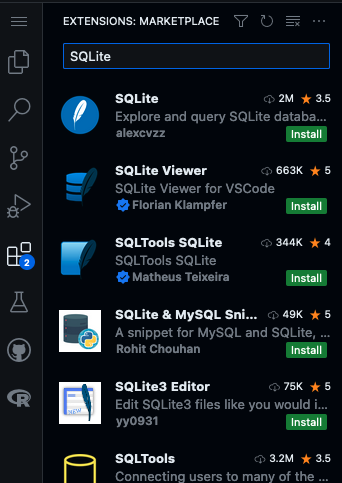

# Zero-setup R-Studio with GitHub Codespaces

This is the repository supporting the BD-STEP Kickoff Meeting presentation "SQL Modules Presentation".

You can recreate the demos in the talk using the steps outlined below.

## Dev Containers in GitHub Codepaces

If you have access to GitHub CodeSpaces, click the green "<> Code" button at the top right on this repository page, and then select "Create codespace on main". (GitHub CodeSpaces is available with [GitHub Enterprise](https://github.com/enterprise) and [GitHub Education](https://education.github.com/).)

To open RStudio Server, click the Forwarded Ports "Radio" icon at the bottom of the VS Code Online window.

In the Ports tab, click the Open in Browser "World" icon that appears when you hover in the "Local Address" column for the Rstudio row.

This will launch RStudio Server in a new window. Log in with the username and password `rstudio/rstudio`. 

* NOTE: Sometimes, the RStudio window may fail to open with a timeout error. If this happens, try again, or restart the Codepace.

In RStudio, use the File menu to open the `/workspaces`, folder and then browse to open the file `devcontainers-rstudio`

## VS Extensions

This presentation will initiate a small generic database file to store data in called "".

In order to view this database and its schema with more fidelity, you will need to intall a VS Extension such as _SQLite_ in order to do so. You can do so by clicking on _Extensions_ on the left toolbar of VS. 

* NOTE: Some extensions may cause errors in the Codespace, making it unable to recover when it restarts. So be sure to disable the extension when done with it. 

## Expectations of this Presentation
-   This presentation will expand upon the *Good Practices in Reproducible Data Science* presented at previous BD-STEP Presentations.

-   Using R and SQL this presentation will explore implementing SQL Queries more seamlessly into your R/Rmd files.

-   The code run will consist of the RMarkdown File [SQL_RLibrary_Tutorial.Rmd](code/SQL_RLibrary_Tutorial.Rmd). 

# Resources and Links

* [GitHub Codespaces](https://github.com/features/codespaces) - Available with GitHub Enterprise and GitHub Education
* [Rocker](https://www.rocker-project.org/) - Containers for R 
* [Dev Containers](https://containers.dev/) - Overview and specification
* [Dev Containers in Visual Studio Code](https://marketplace.visualstudio.com/items?itemName=ms-vscode-remote.remote-containers) - Remote-Containers extension 
* [Visual Studio Code](https://code.visualstudio.com/) - Free editor available for Windows, Mac and Linux
* [Synthetic Medical Dataset](https://www.kaggle.com/datasets/imtkaggleteam/synthetic-medical-dataset?select=encounters.csv) - Used to demonstrate a OMOP-light dataset experience
